# llm-tools

> **The missing standard library for Agentic Workflows.**
> *Native Go. Single Binary. 100x Faster than Python.*

[](https://go.dev/)
[](LICENSE)
[](https://github.com/samestrin/llm-tools/actions)
[](https://github.com/samestrin/llm-tools/releases/latest)

## ⚡ Why this exists

LLM Agents need to be fast. Waiting 400ms for a Python script to spin up just to read a file kills the flow of an autonomous loop.

**llm-tools** is a suite of high-performance, statically compiled tools designed to be the "hands" of your AI agent. It includes a native **MCP Server** for instant integration with Claude Desktop and Gemini.

### The "Rewrite it in Go" Effect

<div align="center">
  
</div>

I benchmarked this against my original Python implementation on a real-world codebase (21k files). The difference was _massive_.

| Operation | Action | Go (Native) | Python | Speedup |
|-----------|-------------|-----|--------|---------|
| **MCP Handshake** | **Server Initialization** | **4ms** | **408ms** | **🚀 102x** |
| Startup | CLI Help | 6ms | 113ms | **19x** |
| Multigrep | Search 5 keywords (150k hits) | 1.47s | 20.7s | **14x** |
| Hash | SHA256 Verification | 6ms | 65ms | **10.8x** |

> *Benchmarks run on M4 Pro 64gb macOS Darwin (arm64), 2025-12-26.*

### 🚫 No Python Venv Hell
Deploying Python-based agent tools is painful. You have to manage virtual environments, `pip install` dependencies, and worry about version conflicts. 
**llm-tools** is a single static binary. It works instantly on any machine—no setup required.

## 🤖 Standardized LLM Orchestration

**llm-tools** isn't just for reading files; it's a reliability layer for your agent's cognitive functions. 

The `prompt` command acts as a **Universal Adapter** for almost any LLM CLI (`gemini`, `claude`, `ollama`, `openai`, `octo`). It wraps them with:
*   **Retries & Backoff:** Automatically retries failed API calls.
*   **Caching:** Caches expensive results to disk (`--cache-ttl 3600`).
*   **Validation:** Ensures output meets criteria (`--min-length`, `--must-contain`) or fails fast.

```bash
# Reliable, cached, validated prompt execution
llm-support prompt \
  --prompt "Analyze this error log" \
  --llm gemini \
  --retries 3 \
  --cache \
  --min-length 50
```

## ⚡ Advanced Workflows

### Parallel Batch Processing (`foreach`)
Run prompts across thousands of files in parallel without writing a loop script. Perfect for migrations, code reviews, or documentation generation.

```bash
# Review all Go files in parallel (4 concurrent workers)
llm-support foreach \
  --glob "src/**/*.go" \
  --template templates/code-review.md \
  --llm claude \
  --parallel 4 \
  --output-dir ./reviews
```

## 🚀 Quick Start

### Pre-built Binaries

Recommended: [Download the latest binary](https://github.com/samestrin/llm-tools/releases) for your OS. No dependencies required.

| Platform | Download |
|----------|----------|
| macOS (Apple Silicon) | [llm-tools-darwin-arm64.tar.gz](releases/v1.0.0/llm-tools-darwin-arm64.tar.gz) |
| macOS (Intel) | [llm-tools-darwin-amd64.tar.gz](releases/v1.0.0/llm-tools-darwin-amd64.tar.gz) |
| Linux (AMD64) | [llm-tools-linux-amd64.tar.gz](releases/v1.0.0/llm-tools-linux-amd64.tar.gz) |
| Windows | [llm-tools-windows-amd64.zip](releases/v1.0.0/llm-tools-windows-amd64.zip) |

### Installation (Go)

```bash
go install github.com/samestrin/llm-tools/cmd/llm-support@latest
go install github.com/samestrin/llm-tools/cmd/llm-clarification@latest
```

## 💡 Common Recipes

See what's possible with a single line of code:

```bash
# Find all TODOs and FIXMEs (Fast grep)
llm-support grep "TODO|FIXME" . -i -n

# Show project structure (3 levels deep)
llm-support tree --path . --depth 3

# Search for multiple definitions in parallel (Token optimized)
llm-support multigrep --path src/ --keywords "handleSubmit,validateForm" -d

# Extract data from JSON without jq
llm-support json query response.json ".users[0]"

# Calculate values safely
llm-support math "round(42/100 * 75, 2)"

# Generate config from template
llm-support template config.tpl --var domain=example.com --var port=8080

# Hash all Go files (Integrity check)
llm-support hash internal/**/*.go -a sha256

# Count completed tasks in a sprint plan
llm-support count --mode checkboxes --path sprint/plan.md -r

# Detect project stack
llm-support detect --path .

# Extract only relevant context (AI-filtered)
llm-support extract-relevant --path docs/ --context "Authentication Config"

# Summarize directory content for context window (Token optimized)
llm-support summarize-dir src/ --format outline --max-tokens 2000

# Batch process files with a template (LLM-driven)
llm-support foreach --files "*.ts" --template refactor.md --parallel 4
```

## 📚 Documentation

Detailed references for all 40+ commands:

*   **[llm-support Commands](docs/llm-support-commands.md)** - File ops, search, analysis, and data processing.
*   **[llm-clarification Commands](docs/llm-clarification-commands.md)** - Long-term memory and decision tracking system.
*   **[MCP Setup Guide](docs/MCP_SETUP.md)** - Integration with Claude Desktop & Gemini.
*   **[Quick Reference](docs/quick-reference.md)** - Cheat sheet.

## 🧠 How It Works

**The Loop:**
1. Agent receives a task.
2. `llm-support` provides fast codebase context (files, structure, search results).
3. `llm-clarification` recalls past decisions ("Use Jest, not Mocha") to prevent regression.
4. Agent generates code with full context.

```mermaid
sequenceDiagram
    participant U as 👤 User
    participant A as 🤖 Agent
    participant S as ⚡ Support
    participant M as 🧠 Memory
    participant C as 📂 Codebase

    U->>A: /execute-sprint
    
    rect rgb(30, 30, 30)
        note right of A: Fast Context
        A->>S: multiexists, count, report
        S-->>A: ✓ Context Loaded (22ms)
    end
    
    rect rgb(50, 20, 20)
        note right of A: Long-Term Memory
        A->>M: match-clarification
        M-->>A: ⚠ RECALL: "Use Jest"
    end

    A->>C: TDD Implementation (using Jest)
```



## License

[MIT License](LICENSE)
