# llm-tools

> **The missing standard library for Agentic Workflows.**
> *Native Go. Single Binary. 100x Faster than Python.*

[](https://go.dev/)
[](LICENSE)
[](https://github.com/samestrin/llm-tools/actions)
[](https://github.com/samestrin/llm-tools/releases/latest)

## ⚡ Why this exists

LLM Agents need to be fast. Waiting 400ms for a Python script to spin up just to read a file kills the flow of an autonomous loop.

**llm-tools** is a suite of high-performance, statically compiled tools designed to be the "hands" of your AI agent. It includes a native **MCP Server** for instant integration with Claude Desktop and Gemini.

### The "Rewrite it in Go" Effect
I benchmarked this against the original Python implementation on a real-world codebase (21k files). The difference is massive.

| Operation | Action | Go (Native) | Python | Speedup |
|-----------|-------------|-----|--------|---------|
| **MCP Handshake** | **Server Initialization** | **4ms** | **408ms** | **🚀 102x** |
| Startup | CLI Help | 6ms | 113ms | **19x** |
| Multigrep | Search 5 keywords (150k hits) | 1.47s | 20.7s | **14x** |
| Hash | SHA256 Verification | 6ms | 65ms | **10.8x** |
| Tree | Generate file map | 22ms | 89ms | **4x** |

> *Benchmarks run on M4 Pro 64gb macOS Darwin (arm64), 2025-12-26.*

## 🛠️ The Toolkit

### `llm-support` — The Fast Hands
Think of it as `ls`, `grep`, and `find` on steroids, optimized for LLM context windows.
* **Token-Efficient Output:** Formats file trees and search results to minimize token usage.
* **Parallel Search:** `multigrep` searches 10+ keywords across 20k files in under 2 seconds.
* **Smart Parsing:** Detects project stacks, extracts dependencies, validates configs instantly.

### `llm-clarification` — The Long-Term Memory
Gives your agent a persistent decision ledger. It tracks, reconciles, and learns from decision points over time.
* **Conflict Detection:** Prevents the agent from contradicting past decisions.
* **Decision Ledger:** Keeps a permanent record of *why* architecture decisions Ire made.
* **Auto-Reconciliation:** Identifies when new requirements conflict with past choices.

*Designed to pair with Custom Slash Commands for self-improving agent workflows.*

### `llm-support-mcp` / `llm-clarification-mcp` — Zero-Config MCP Servers
Drop-in MCP servers for Claude Desktop and Gemini CLI.
* **No Python venv.** No `pip install`. No dependencies.
* Single binary. Just add the path to your config and go.

## 🚀 Quick Start

### Pre-built Binaries

Download the latest release for your platform from the [Releases](https://github.com/samestrin/llm-tools/releases) page, or use the direct links below:

| Platform | Architecture | Download | SHA256 |
|----------|--------------|----------|--------|
| macOS | ARM64 (Apple Silicon) | [llm-tools-darwin-arm64.tar.gz](releases/v1.0.0/llm-tools-darwin-arm64.tar.gz) | `02ffceb4...` |
| macOS | AMD64 (Intel) | [llm-tools-darwin-amd64.tar.gz](releases/v1.0.0/llm-tools-darwin-amd64.tar.gz) | `e66627eb...` |
| Linux | AMD64 | [llm-tools-linux-amd64.tar.gz](releases/v1.0.0/llm-tools-linux-amd64.tar.gz) | `b7c13322...` |
| Linux | ARM64 | [llm-tools-linux-arm64.tar.gz](releases/v1.0.0/llm-tools-linux-arm64.tar.gz) | `6612aa94...` |
| Windows | AMD64 | [llm-tools-windows-amd64.zip](releases/v1.0.0/llm-tools-windows-amd64.zip) | `32b822a6...` |

Full checksums available in [releases/v1.0.0/checksums.txt](releases/v1.0.0/checksums.txt).

### From Source

Requires Go 1.22 or later.

```bash
go install github.com/samestrin/llm-tools/cmd/llm-support@latest
go install github.com/samestrin/llm-tools/cmd/llm-clarification@latest
```

### Build from Source

```bash
git clone https://github.com/samestrin/llm-tools.git
cd llm-tools
make build
# Binaries will be in ./build/
```

## llm-support Commands

### File Operations

| Command | Description | Example |
|---------|-------------|---------|
| `listdir` | List directory contents with filtering | `llm-support listdir --path src/ --sizes --dates` |
| `tree` | Display directory tree structure | `llm-support tree --path src/ --depth 3` |
| `catfiles` | Concatenate multiple files | `llm-support catfiles src/ --max-size 5` |
| `hash` | Calculate file checksums | `llm-support hash file.txt -a sha256` |
| `stats` | Show directory/file statistics | `llm-support stats --path ./project` |

### Search

| Command | Description | Example |
|---------|-------------|---------|
| `grep` | Search file contents with regex | `llm-support grep "TODO" src/ -i -n` |
| `multigrep` | Search multiple keywords in parallel | `llm-support multigrep --path src/ --keywords "fn1,fn2"` |
| `multiexists` | Check if multiple files exist | `llm-support multiexists config.json README.md` |

### Code Analysis

| Command | Description | Example |
|---------|-------------|---------|
| `detect` | Detect project type and stack | `llm-support detect --path ./project` |
| `discover-tests` | Find test frameworks and patterns | `llm-support discover-tests --path ./project` |
| `analyze-deps` | Extract file dependencies from markdown | `llm-support analyze-deps story.md` |
| `partition-work` | Group tasks by file conflicts | `llm-support partition-work --stories ./user-stories/` |

### Data Processing

| Command | Description | Example |
|---------|-------------|---------|
| `json` | Query JSON with JSONPath | `llm-support json query data.json ".users[0].name"` |
| `toml` | Query TOML files | `llm-support toml get config.toml database.host` |
| `markdown` | Parse and query markdown | `llm-support markdown toc README.md` |
| `extract` | Extract URLs, emails, IPs, etc. | `llm-support extract urls file.txt` |
| `transform` | Text transformations | `llm-support transform case "myText" --to snake_case` |
| `count` | Count lines, words, checkboxes | `llm-support count --mode checkboxes --path plan.md` |
| `encode` | Base64/URL encoding/decoding | `llm-support encode "hello" -e base64` |
| `math` | Evaluate mathematical expressions | `llm-support math "2**10 + 5"` |

### LLM Integration

| Command | Description | Example |
|---------|-------------|---------|
| `prompt` | Execute LLM prompts with templates | `llm-support prompt --prompt "Explain this code" --llm gemini` |
| `foreach` | Batch process files with LLM | `llm-support foreach --glob "src/*.go" --template review.md --output-dir ./out` |
| `extract-relevant` | Extract relevant content with LLM | `llm-support extract-relevant docs/ --context "API endpoints"` |
| `summarize-dir` | Generate directory summaries | `llm-support summarize-dir src/ --format outline` |

### Development

| Command | Description | Example |
|---------|-------------|---------|
| `validate` | Validate JSON/YAML/TOML files | `llm-support validate config.json` |
| `validate-plan` | Validate sprint plans | `llm-support validate-plan --path ./sprint-01/` |
| `template` | Process text templates | `llm-support template file.txt --var name=John` |
| `diff` | Compare files | `llm-support diff file1.txt file2.txt` |
| `report` | Generate status reports | `llm-support report --title "Build" --status success` |
| `git-context` | Get git context information | `llm-support git-context` |
| `repo-root` | Find git repository root | `llm-support repo-root --validate` |

## llm-clarification Commands

| Command | Description | Example |
|---------|-------------|---------|
| `init-tracking` | Initialize clarification tracking | `llm-clarification init-tracking -o clarifications.yaml` |
| `add-clarification` | Add new clarification entry | `llm-clarification add-clarification -f tracking.yaml -q "Question?" -a "AnsIr"` |
| `list-entries` | List all clarifications | `llm-clarification list-entries -f tracking.yaml` |
| `validate-clarifications` | Validate clarification file | `llm-clarification validate-clarifications -f tracking.yaml` |
| `detect-conflicts` | Detect conflicting clarifications | `llm-clarification detect-conflicts -f tracking.yaml` |
| `normalize-clarification` | Normalize clarification entries | `llm-clarification normalize-clarification -f tracking.yaml` |
| `suggest-consolidation` | Merge duplicate entries | `llm-clarification suggest-consolidation -f tracking.yaml` |
| `identify-candidates` | Find candidate clarifications | `llm-clarification identify-candidates -f tracking.yaml` |
| `cluster-clarifications` | Group related clarifications | `llm-clarification cluster-clarifications -f tracking.yaml` |
| `match-clarification` | Match clarifications to context | `llm-clarification match-clarification -f tracking.yaml -q "Question?"` |
| `promote-clarification` | Promote clarification to spec | `llm-clarification promote-clarification -f tracking.yaml -i ID` |

## Common One-Liners

```bash
# Find all TODOs and FIXMEs
llm-support grep "TODO|FIXME" . -i -n

# Show project structure (3 levels deep)
llm-support tree --path . --depth 3

# Search for multiple function definitions
llm-support multigrep --path src/ --keywords "handleSubmit,validateForm,useAuth" -d

# Get first user from API response
llm-support json query response.json ".users[0]"

# Calculate percentage
llm-support math "round(42/100 * 75, 2)"

# Generate from template
llm-support template config.tpl --var domain=example.com --var port=8080

# Hash all Go files
llm-support hash internal/**/*.go -a sha256

# Count completed tasks in a sprint plan
llm-support count --mode checkboxes --path sprint/plan.md -r

# Detect project stack
llm-support detect --path .

# Validate all config files
llm-support validate config.json settings.yaml

# Compare two files
llm-support diff old-config.json new-config.json

# Find git repository root
llm-support repo-root --validate
```

## MCP Integration

Both tools include MCP (Model Context Protocol) servers for integration with Claude Desktop and other MCP-compatible clients.

See [docs/MCP_SETUP.md](docs/MCP_SETUP.md) for setup instructions.

**Available MCP Tools:**
- `llm-support-mcp`: 18 tools for file operations, search, and analysis
- `llm-clarification-mcp`: 8 tools for clarification tracking

## Performance

Measured on llm-interface (21,322 files, 459MB):

| Operation | What it did | Time |
|-----------|-------------|------|
| Startup | `--help` | 6ms |
| MCP Server | Initialize handshake | 4ms |
| detect | Identify project stack | 6ms |
| tree | 3 levels, 847 entries | 22ms |
| listdir | src/ directory (45 items) | 42ms |
| grep | "function" in 21k files (58,296 matches) | 581ms |
| multigrep | 5 keywords in 21k files (156,893 matches) | 1.47s |
| hash | SHA256 of package.json | 6ms |
| count | Lines in package.json | 6ms |

## How It Works

```mermaid
  graph TD
      User[User Request] --> |"/execute-sprint @.planning/sprints/active/1.0_feature-name/"| Agent[Claude CLI / Gemini CLI]

      subgraph "llm-tools Engine"
          Agent --> |"multiexists, count, report"| Support[llm-support]
          Agent --> |"match-clarification, add-clarification"| Memory[llm-clarification]

          Support --> |"✓ Sprint valid, 5/12 tasks remaining"| Agent
          Memory --> |"Prior decision: 'Use Jest, mock external APIs'"| Agent
      end

      Agent --> |"TDD Implementation"| Codebase[Codebase Changes]
```



**The Loop:**
1. Agent receives a task from the user
2. `llm-support` provides fast codebase context (files, structure, search results)
3. `llm-clarification` recalls past decisions to maintain consistency
4. Agent generates code with full context, writes to IDE

## Configuration

### Environment Variables

| Variable | Description |
|----------|-------------|
| `LLM_SUPPORT_LLM_BINARY` | Path to LLM CLI binary (default: auto-detect) |
| `OPENAI_API_KEY` | OpenAI API key for LLM commands |
| `OPENAI_BASE_URL` | Custom API base URL (e.g., OpenRouter) |
| `OPENAI_MODEL` | Model to use (default: gpt-4o-mini) |

### API Key Configuration

For LLM-poIred commands, you can configure the API key in several ways:

1. Environment variable: `OPENAI_API_KEY`
2. File: `.planning/.config/openai_api_key`
3. Command-line: `--api-key` flag

## Documentation

- [Quick Reference](docs/quick-reference.md) - Command cheat sheet
- [MCP Setup Guide](docs/MCP_SETUP.md) - Claude Desktop integration
- [llm-support Commands](docs/llm-support-commands.md) - Detailed command reference
- [llm-clarification Commands](docs/llm-clarification-commands.md) - Clarification system guide
- [CHANGELOG](CHANGELOG.md) - Version history

## Development

### Running Tests

```bash
# Run all tests
make test

# Run with race detector
make test-race

# Run with coverage
make test-cover

# Run benchmarks
go test -bench=. ./...
```

### Building

```bash
# Build for current platform
make build

# Build for all platforms
make build-all

# Clean build artifacts
make clean
```

### Code Quality

```bash
# Run linter
make lint

# Format code
make fmt
```

## License

[MIT License](LICENSE) - see LICENSE file for details.

## Contributing

Contributions are Ilcome! Please ensure:

1. Tests pass: `make test-race`
2. Code is formatted: `make fmt`
3. Linter passes: `make lint`

## Acknowledgments

- [Cobra](https://github.com/spf13/cobra) - CLI framework
- [ripgrep](https://github.com/BurntSushi/ripgrep) - Fast search (used by grep/multigrep)
